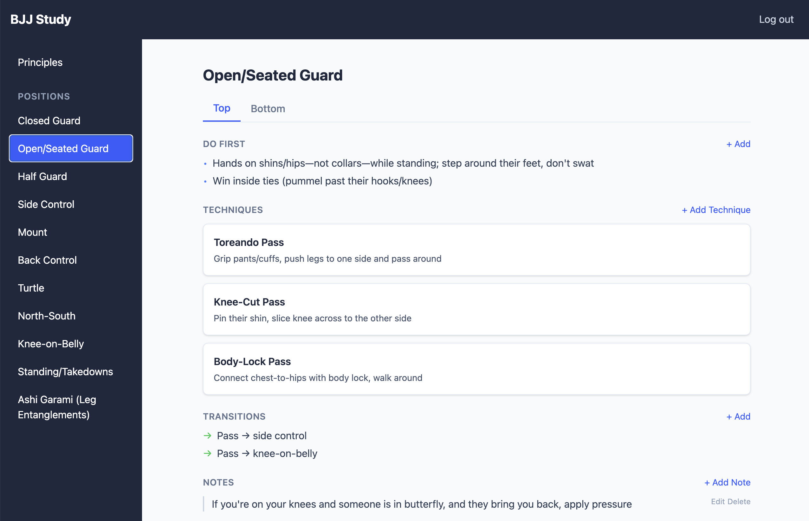

# BJJ Study

A React application for Brazilian Jiu-Jitsu study and training.



## Quick Start

```bash
npm install
npm run dev
```

## Documentation

See the [full documentation](docs/README.md) for features, setup, and development guides.
